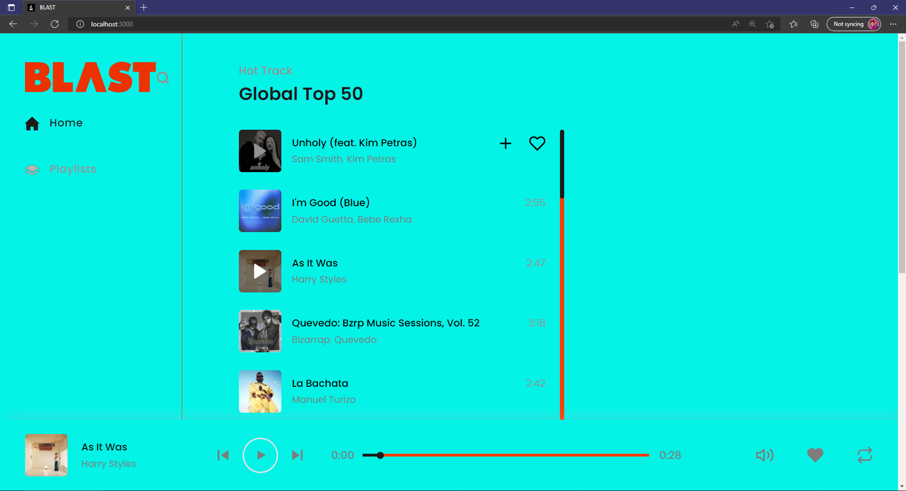
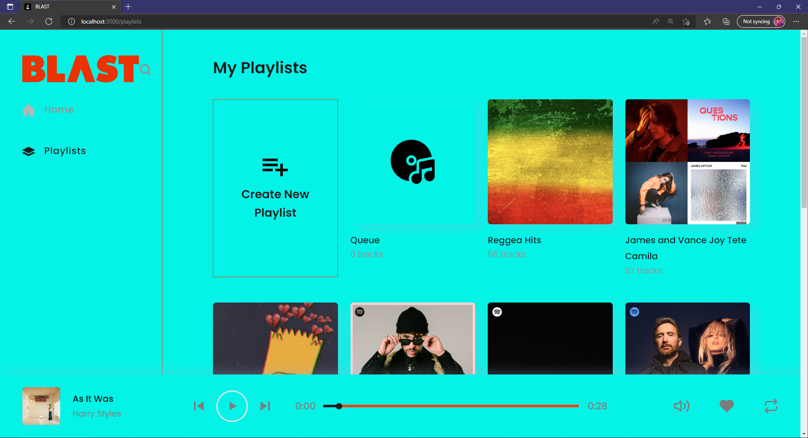
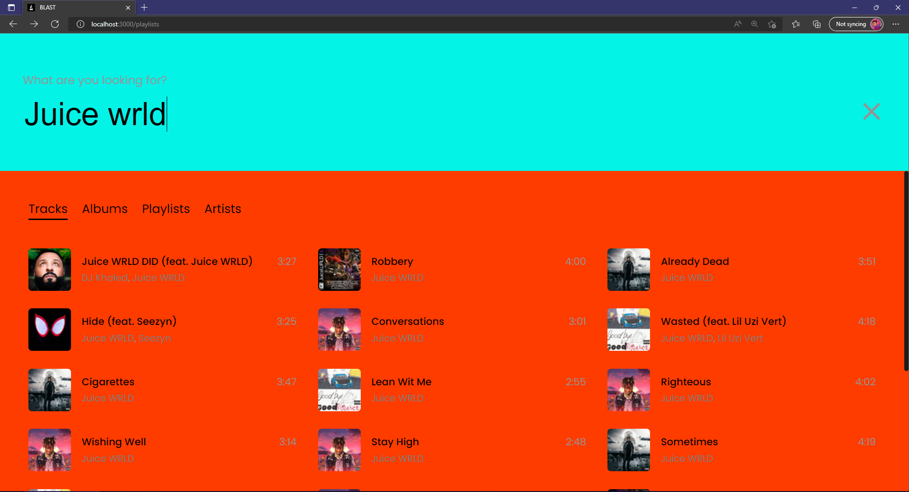
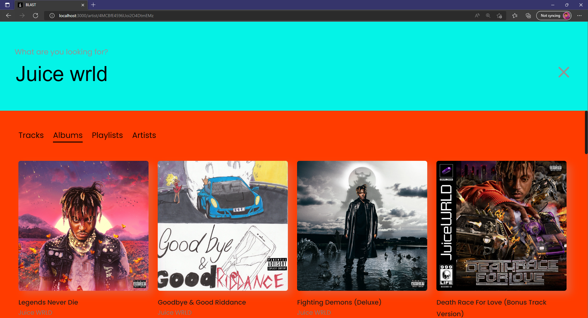

# React-Spotify
Music app, built with React js

# About
Blast is a modern digital audio sequencer. Blast began as our final-year varsity project, to provide a platform that brings all forms of digital audio to the curious listener. Blast aims to become a personalized digital audio streaming platform, tailored towards a niche of audio consumers who prefer a more customized audio streaming environment.

## Features
- Single-Page Application
- Music Player
- Infinite Scroll
- Live Search
- Lazy Loading Images
- Easy Playlist Customization
- Easy to Create or Delete Playlists
- Skeleton Loader
- Filter Top Songs by Country
- Easy to Add Song to Playlist
- Responsive Design

## Screenshots

### SAMPLE 1

<pre>

</pre>
### SAMPLE 2

<pre>

</pre>
### SAMPLE 3

<pre>

</pre>
### SAMPLE 4

<pre>

